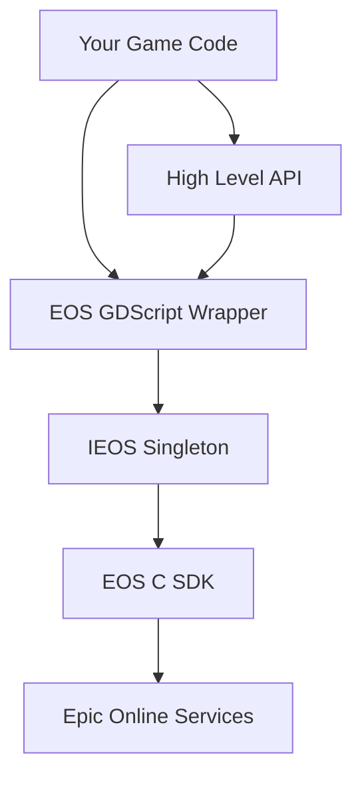

The GDExtension API provides low-level access to Epic Online Services (EOS) functionality in Godot. This API consists of two main components:

- **IEOS Interface**: The C++ singleton that directly wraps the EOS SDK
- **EOS Wrapper**: A GDScript wrapper that provides a more Godot-friendly interface

## When to Use the GDExtension API

The GDExtension API is designed for advanced use cases where you need:

- Direct control over EOS SDK function calls
- Access to features not yet available in the High Level API
- Custom implementations of EOS services
- Fine-grained control over callback handling

## When to Use the High Level API Instead

For most common use cases, the High Level API is recommended because it:

- Provides simpler, more intuitive interfaces
- Handles common patterns and edge cases automatically
- Includes built-in error handling and validation
- Offers better integration with Godot's scene system

Use the High Level API for standard implementations of:
- Player authentication
- Lobbies and matchmaking
- Friends and presence
- Achievements and stats
- Leaderboards

## Architecture



## Key Concepts

### IEOS Singleton

The IEOS class is a C++ singleton (RefCounted) that provides direct bindings to the EOS SDK. It:

- Manages EOS platform initialization and lifecycle
- Exposes all EOS interface methods to Godot
- Handles callback registration and signal emission
- Must be ticked regularly via `IEOS.tick()`

### EOS Wrapper Classes

The GDScript wrapper provides:

- Type-safe option classes for each EOS function
- Static interface classes that mirror EOS SDK structure
- Helper functions for common operations
- Enum definitions for EOS constants

### Options Pattern

All EOS functions use an options pattern:

```gdscript
# Create options object
var options = EOS.Auth.LoginOptions.new()
options.credentials = EOS.Auth.Credentials.new()
options.credentials.type = EOS.Auth.LoginCredentialType.Developer
options.credentials.id = "localhost:7777"
options.credentials.token = "MyUserName"

# Call interface method
EOS.Auth.AuthInterface.login(options)
```

### Callbacks and Signals

EOS operations are asynchronous and use signals for callbacks:

```gdscript
# Connect to callback signal
IEOS.connect("auth_interface_login_callback", _on_login_complete)

# Initiate login
EOS.Auth.AuthInterface.login(options)

# Handle callback
func _on_login_complete(data: Dictionary):
    if EOS.is_success(data):
        print("Login successful!")
    else:
        print("Login failed: ", EOS.result_str(data))
```

## Platform Initialization

Before using any EOS features, you must initialize the platform:

```gdscript
# Initialize EOS SDK
var init_options = EOS.Platform.InitializeOptions.new()
init_options.product_name = "MyGame"
init_options.product_version = "1.0.0"
var init_result = EOS.Platform.PlatformInterface.initialize(init_options)

if not EOS.is_success(init_result):
    push_error("Failed to initialize EOS")
    return

# Create platform instance
var create_options = EOS.Platform.CreateOptions.new()
create_options.product_id = "your_product_id"
create_options.sandbox_id = "your_sandbox_id"
create_options.deployment_id = "your_deployment_id"
create_options.client_id = "your_client_id"
create_options.client_secret = "your_client_secret"
create_options.encryption_key = "your_encryption_key"

var create_result = EOS.Platform.PlatformInterface.create(create_options)
if not create_result:
    push_error("Failed to create EOS platform")
    return
```

## Ticking the Platform

EOS requires regular ticking to process callbacks and events:

```gdscript
func _process(_delta):
    IEOS.tick()
```

## Error Handling

All EOS operations return result codes. Use helper functions to check results:

```gdscript
# Check if operation succeeded
if EOS.is_success(result):
    print("Success!")

# Check if operation completed (success or failure)
if EOS.is_operation_complete(result):
    print("Operation finished")

# Get human-readable result string
print("Result: ", EOS.result_str(result))

# Pretty print result
EOS.print_result(result)
```

## Available Interfaces

The GDExtension API provides access to all EOS interfaces:

- **Platform**: Platform initialization and lifecycle management
- **Auth**: Epic Account authentication
- **Connect**: Product user authentication and device management
- **Friends**: Friends list and social features
- **Presence**: User presence and rich presence
- **Lobby**: Lobby creation and management
- **Sessions**: Session creation and matchmaking
- **P2P**: Peer-to-peer networking
- **Achievements**: Achievement definitions and unlocking
- **Stats**: Player statistics
- **Leaderboards**: Leaderboard queries and rankings
- **Ecom**: In-game store and entitlements
- **UserInfo**: User profile information
- **UI**: EOS overlay and social UI
- **Metrics**: Player session metrics
- **Reports**: Player behavior reporting
- **Sanctions**: Player sanctions and bans
- **KWS**: Kids Web Services (parental controls)
- **CustomInvites**: Custom game invites
- **TitleStorage**: Cloud storage for game data
- **PlayerDataStorage**: Cloud storage for player data
- **Mods**: Mod installation and management
- **RTC**: Real-time communication (voice/data)
- **AntiCheat**: Anti-cheat client and server

## Next Steps

- Learn about the [IEOS Interface](/gdextension/ieos-interface) for low-level SDK access
- Explore the [EOS Wrapper](/gdextension/eos-interface) for GDScript-friendly interfaces
- Check the [High Level API](/customize/high-level-api/overview) for simpler implementations
